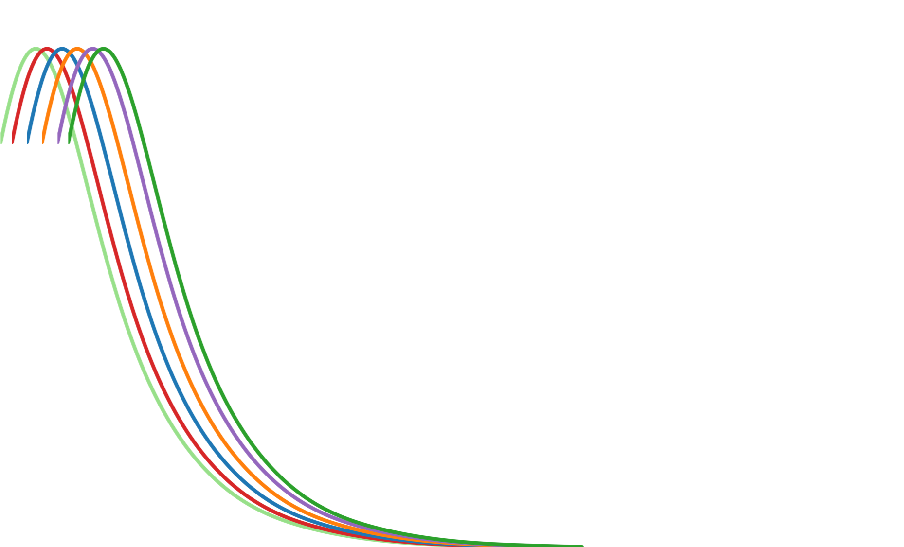

```{r, include=FALSE}
knitr::opts_chunk$set(
  results='asis', 
  echo = FALSE
)
PDF_EXPORT <- FALSE

library(glue)
library(tidyverse)

# Holds all the links that were inserted for placement at the end
links <- c()

source('parsing_functions.R')

# Load csv with position info
position_data <- read_csv('data/positions.csv')
```


Aside
================================================================================


{width=100%}

Contact {#contact}
--------------------------------------------------------------------------------


- <i class="fa fa-envelope"></i> sheaconnell@gmail.com
- <i class="fa fa-twitter"></i> [\@Shedimus](https://twitter.com/Shedimus)
- <i class="fa fa-github"></i> [Shedimus](https://github.com/Shedimus)
- <i class="fas fa-university"></i> [Shea P. Connell](https://scholar.google.com/citations?user=rgzC_hIAAAAJ&hl=en)
- <i class="fa fa-linkedin"></i> [SheaConnell](https://www.linkedin.com/in/sheaconnell/)
- <i class="fa fa-phone"></i> +44 (0) 7587 103339


Skills {#skills}
--------------------------------------------------------------------------------

```{r}
skills <- tribble(
  ~skill,                   ~level,
  "R",                       5,
  "Data Analysis",           4.5,
  "Visualisation",           4,
  "Machine Learning",        3.5,
  "Experiment Design",       3.25,
  "SQL",                     3
)

build_skill_bars(skills)
```


Disclaimer {#disclaimer}
--------------------------------------------------------------------------------

Made using the [**pagedown**](https://github.com/rstudio/pagedown) package for R. 

The source code is available at [github.com/Shedimus/CV](https://github.com/Shedimus/cv).

Last updated on `r Sys.Date()`.


Main
================================================================================

Shea O'Connell {#title}
--------------------------------------------------------------------------------


```{r}
intro_text <- "During my PhD I developed predictive models for a [urine-based test for prostate cancer](https://www.bbc.com/news/health-48756732), robust machine-learning pipelines for [automated & reproducible biomarker discovery in multi-omic prostate cancer studies](Link to ExoMeth/Spec/Grail), and collaborated on [R packages](https://github.com/brentthorne/posterdown) that let you [make award-winning posters](http://SheaConnell.me/EACR_Poster/).

I am currently searching for a data science position where I can make an impact with data and bring change to people's lives. Keenly interested in helping others understand and explore their data from start to finish from experiment design & data collection through to machine learning and dynamic visualistions."

cat(sanitize_links(intro_text))
```


Education {data-icon=graduation-cap data-concise=true}
--------------------------------------------------------------------------------

```{r}
print_section(position_data, 'education')
```


Employment {data-icon=suitcase}
--------------------------------------------------------------------------------

::: aside
I have worked in a variety of roles ranging from commercial diver to marine biologist to clinical data scientist. I like to work as part of a collaborative team moving towards similar goals. 
:::

```{r}
print_section(position_data, 'employment')
```

<br>
<br>
<br>

Training and Skills {data-icon=chalkboard-teacher}
--------------------------------------------------------------------------------

::: aside
I enjoy learning and skill development. Given enough time I'm comfortable learning any new skill, language or method, and believe that domain knowledge, while powerful, shouldn't set the limits of study.
:::

```{r}
print_section(position_data, 'training_skills')
```


Publications, Posters, and Talks {data-icon=book}
--------------------------------------------------------------------------------

```{r}
print_section(position_data, "academic_articles")
```

Awards and Interests {data-icon=award}
--------------------------------------------------------------------------------

```{r}
print_section(position_data, 'awards_personal')
```
